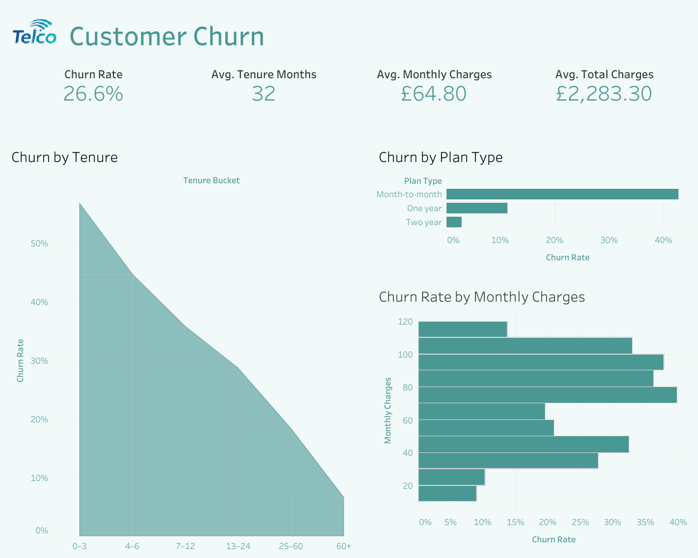

# Customer Churn Analysis - Telco

## TLDR
Analysed customer churn behaviour for a subscription-based telecom business
to identify high-risk customer segments. Found that churn is concentrated
among early-tenure customers, month-to-month contracts, and higher-priced
plans, suggesting onboarding, contract structure, and pricing as key churn
drivers.

## Dashboard Snapshot



---

## Business Question
Who is churning, when do they churn, and which customer characteristics are
most strongly associated with churn?

---

## What This Project Demonstrates
- End-to-end churn analysis using real-world style data
- Clean separation of raw and processed datasets
- SQL-driven segmentation and metric calculation
- Python-based data cleaning and exploratory analysis
- Clear communication of insights via a Tableau dashboard

---

## Project Structure
```
customer-churn/
├── datasets/      # Raw and cleaned datasets
├── sql/           # SQL queries and documented insights
├── python/        # Data cleaning script and EDA notebook
├── dashboards/    # Tableau dashboard link and documentation
├── images/        # Dashboard screenshot
└── README.md
```

---

## Key Insights
- Overall churn rate is **~26.6%**, indicating churn is a material business issue
- Churn is highest within the **first 3 months** of customer tenure and declines
  significantly as tenure increases
- **Month-to-month** contracts exhibit substantially higher churn than
  one- and two-year plans
- Higher monthly charges are associated with higher churn rates, suggesting
  price sensitivity among certain customer segments

These findings point toward onboarding, contract incentives, and pricing
strategy as the most effective levers for reducing churn.

---

## Dashboard
An interactive Tableau dashboard summarising the key churn metrics and trends
is available here:

📊 **Customer Churn Overview (Tableau)**  
👉 See `dashboards/dashboard_link.txt` for the public URL

The dashboard presents:
- Top-level churn KPIs
- Churn by tenure bucket
- Churn by plan type
- Churn by monthly charges

---

## Data Notes
- Dataset sourced from the publicly available Telco Customer Churn dataset
- Raw data is treated as immutable
- All transformations are applied programmatically in Python
- Cleaned dataset serves as the single source of truth for SQL, Python,
  and dashboard analysis

---

## Tools Used
- SQL - churn metrics, segmentation, and aggregation
- Python - data cleaning and exploratory analysis
- Tableau - dashboarding and insight communication
- Git & GitHub - version control and project documentation


